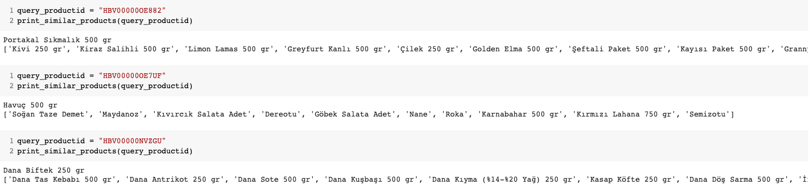
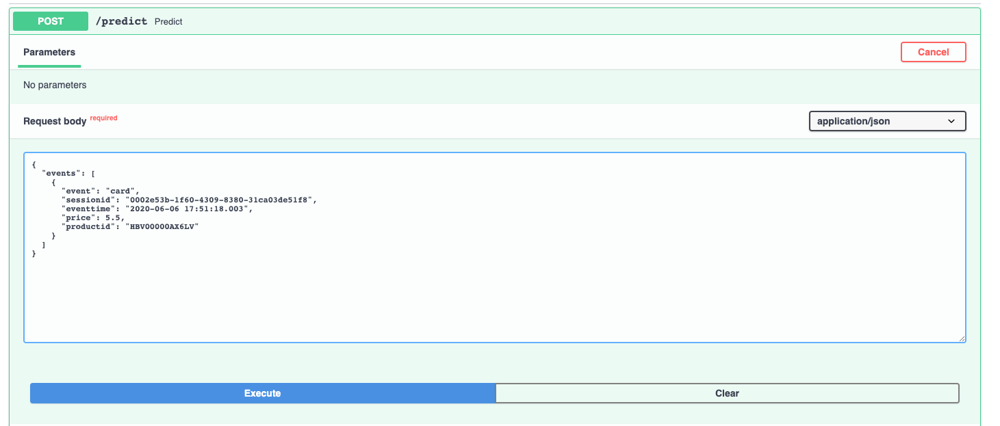
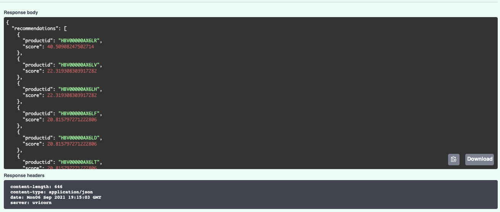

# Welcome to Simple Recommender Sysyem
This project aim to simple recommendation system using Item2Vec approach and BM25 algorithm.
We use implicit feedbacks to recommend product for user.

Traditional architecture for recommendation systems consists of the following components:
* candidate generation: Item2Vec and BM25 for my implementation. We use it to reduce search space because there can be millions of products.
* personalization: We dont have any user data. If the person has always drank gluten-free while making a milk recommendation, we should pay attention to this.
* re-ranking: Best selling products and price and brand segmentation

## Item2Vec
Identify word and sentence equivalents from data. Word embeddings can learn sequence of words each sentence. For the model to learn the embedding, we need to get the “word” and “sentence” equivalents from the data. Here it can be imagined that each “product” is a “word”, and products that received similar signals from a user are in the same “sentence”. Specifically, “sentences” are generated with the following process: For each user, generate sessions each session have list of items which added to card by the user. Those lists are the inputs to train the Gensim Word2Vec model.

Item2Vec approach subfield of Collaborative filtering.

### Pros
* We dont need the product information. The products that users navigate during the session will be sufficient.
* Easily applicable
* If we have millions of product we can use approximate nearest neighbour techniques like PQ, HNSW ... for faster search. Implementations of these algorithms can be found in the [Faiss](https://github.com/facebookresearch/faiss) library.

### Cons
* OOV problem :( 
* Cannot offer recommendations new product or less visited products
* We need to keep our vector database up to date

## BM25
BM25 is a ranking function used by search engines to estimate the relevance of documents to a given search query. BM25 work like TF-IDF algorithm but BM25 goes beyond this to account for document length and term frequency saturation.

### Pros
* Can recommend new product easily
* There is a no OOV problems :)

### Cons
* Not very good as there is no information about user behavior
* Very simple 
* It cannot make suggestions in different categories because it is keyword-based.
* Misspelling words can hurt retreival perfomance

## Possible Solutions
For better recomendations we need to care price of each product and brands
* Price Segmentation and Brand Segmentation can be added
* Association analysis for product, brand, category
* I need to implement reranking algorithm. Xgboost or LightGBM algorithms can be use learning to rank. Recursive feature elimination technique can be used for feature importance. Or we can use black box explanation libraries like shap.
* Product, Session Matrix to Get Similar Products (I implement this in notebook but not in docker) Create product, session matrix. Then calculate cosine similarity to similar products. This solutions need to store product2session matrix.
* If i have more time i will be implement two-tower model. Which can be calculate session to item similarity.
* Recommendations should be made taking into account the profit of the company. High CR and CTR may not profitable.
* By including user visit favorite information in the system, better recommendation systems can be developed with reinforcement algorithms.

# Evaluation metrics
All data must be split "sessionid" col for train, test and val data
I dont have time so i cant calculate  recommendation metrics like Ndcg@k, mAP@k, MRR, precision@k, recall@k :/

Ndcg@10 can be use for evaluation and A/B testing

Our KPIs:
* Be able to recommend the products that the customer needs in a short time
* Increase CR and CTR

# Installation
It is recommended to install with docker to avoid any problems with the installation.
You can also install libraries with pip required dependency.
If you want to update Item2Vec database you need to run Notebook/Recommender.ipynb

* pip install -r requirements.txt

## Build Docker Container

`docker build -t recomender-system-demo:latest .`

## Run Docker Container

`docker run -d -p 8000:8000 recomender-system-demo`

## Example API Request
You can send api request after installing docker.
When you go to the web browser you use and go to this [link](http://localhost:8000/docs), swagger will open, you can test it from there.

curl -X POST "http://0.0.0.0:8000/predict" -H  "accept: application/json" -H  "Content-Type: application/json" -d "{\"events\":[{\"event\":\"card\",\"sessionid\":\"0002e53b-1f60-4309-8380-31ca03de51f8\",\"eventtime\":\"2020-06-06 17:51:18.003\",\"price\":5.5,\"productid\":\"HBV00000AX6LV\"}]}"

## Contact

If you have any question contact with me "mustfkeskin@gmail.com"

## License

This project is released under the MIT License.
